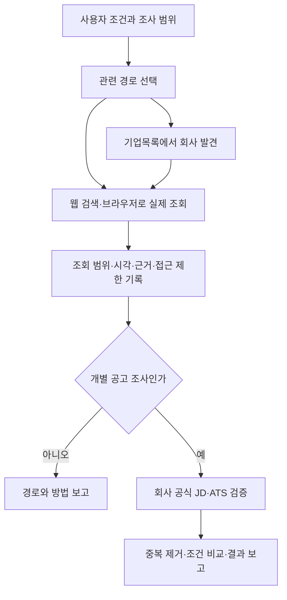

# Korean Job Discovery Skill

한국 채용정보를 **여러 경로에서 발견하고, 현재 회사·기관 공식 공고에서 검증**하는 에이전트 스킬입니다. 채용사이트 이름을 나열하는 데서 끝나지 않고, 요청의 직무·지역·경력 수준에 맞는 경로 선택과 검색 기록까지 안내합니다.

**For other agents:** Read [SKILL.md](skills/korean-job-discovery/SKILL.md), then its relative references. Use your own web-search/browser tools. The optional Python helpers are offline planners/auditors, not web crawlers. No private profile, API key, particular model, or MCP is required.

## 목차

- [무엇을 하는가](#무엇을-하는가)
- [탐색 경로](#탐색-경로)
- [설치와 호출](#설치와-호출)
- [실제 사용 흐름](#실제-사용-흐름)
- [Python 보조 도구](#python-보조-도구)
- [다른 에이전트에서 사용하기](#다른-에이전트에서-사용하기)
- [결과의 의미와 한계](#결과의-의미와-한계)
- [파일 구조와 유지보수](#파일-구조와-유지보수)

## 무엇을 하는가

두 종류의 요청을 처리합니다.

| 요청 | 결과 |
| --- | --- |
| “부산 신입 QA·기술지원 채용을 찾아줘” | 여러 경로에서 발견 → 중복 제거 → 공식 JD 검증 → 공고와 탐색 기록 |
| “원티드·사람인 말고 채용을 찾을 방법을 알려줘” | 경로의 현재 운영·검색 기능·특성·한계와 활용 방법 |

개별 회사만 요청하면 그 회사에 집중합니다. 신입 채용을 요청했다고 석박사 연구직·경력직·해외근무를 임의로 추천하지 않습니다. 특정 개인의 경력이나 원장에 의존하지 않아, 다른 사용자에게도 적용할 수 있습니다.

## 탐색 경로

[전체 카탈로그](skills/korean-job-discovery/references/channel-catalog.md)와 [기계 판독 JSON](skills/korean-job-discovery/references/channels.json)에 **49개 탐색 진입점**을 담았습니다. 2026-10-06에 조사한 추가 경로 43개와 기존 일반·SNS 경로 6개를 합친 수입니다. 독립적인 49개 데이터베이스를 의미하지 않습니다.

| 유형 | 대표 경로 | 쓰임 |
| --- | --- | --- |
| 범용 채용 | 사람인·원티드·캐치·자소설닷컴·잡코리아·인크루트·고용24·잡플래닛 | 직무·지역·신입 조건으로 폭넓게 발견 |
| IT·스타트업 | 점핏·로켓펀치·OKKY Jobs | 기술스택·역할·숙련도 검색 |
| 신입·인턴 | 슈퍼루키·링커리어 | 신입/인턴 분류; 교육·대외활동 구분 |
| 직무 큐레이션 | 인디스워크 | IT·데이터·리서치·운영 등 분류 |
| 금융 | 금융투자협회 회원사 채용안내 | 증권·운용사 리서치·운용지원·전산 등 |
| 이공계·연구 | RND JOB·KIRD K-클럽·NST | 연구·기술·연구지원; 학력 조건 분리 |
| 공공 | 잡알리오·클린아이·나라일터 | 공공기관·지방기관·공무직 분리 |
| 지역 | 부산·경남 포털·테크노파크·산업단지 | 지역별 게시판과 업체 발견 |
| 대학·학과 | 부산대·경상국립대·창원대 예시 | 일반/추천채용·학과 공지·PDF |
| 국내 외국계 | 피플앤잡·KOTRA 특화관·LinkedIn | 영문 직함·국내 근무지 |
| 해외 | 월드잡플러스·LinkedIn | 국가·비자·근로조건을 별도 검증 |
| 기업 발견 | THE VC·Startup Alliance·D.CAMP·TIPS·전시회 | 회사 이름 발굴 → 공식 careers |
| 기업 공식 ATS | 그리팅·Lever·Greenhouse·Ashby | 도메인/PDF 검색으로 누락 보완 |
| SNS·커뮤니티 신호 | X·Instagram·GeekNews·Disquiet | 공개 글에서 기업·채용 단서 발견 |

부산·경남·대학 URL은 **지역 예시**입니다. 서울·대전 등 다른 지역을 요청하면 해당 지역의 공식 포털·대학·협회 경로를 찾아 적용합니다. 특정 SNS 큐레이터나 무관한 지역을 모든 사용자에게 강제하지 않습니다.

최초 조사에서 추가 경로 35개는 본문/기능 안내를 확인했고 8개는 접근·목록 추출에 제한이 있었습니다. 기존 6개는 이번 추가 경로 조사에서 재검증하지 않았습니다. 이 숫자는 **과거 경로 확인 기록**이며 지금 지원 가능한 공고 수가 아닙니다.

## 설치와 호출

### Codex

Codex의 skill-installer가 제공되는 환경에서는 다음처럼 요청할 수 있습니다.

> GitHub Kimhyuntae9665/codex-skill-korean-job-discovery의 skills/korean-job-discovery를 v1.0.0 기준으로 설치해줘.

수동 설치는 저장소에서 **skills/korean-job-discovery 폴더 전체**를 사용 환경의 스킬 디렉터리에 복사합니다. SKILL.md 하나만 복사하면 참고자료와 스크립트 연결이 끊깁니다. 기존 설치가 있으면 먼저 백업하거나 변경을 비교하세요.

기본 ~/.codex/skills를 사용하는 Bash 예시:

```sh
git clone --branch v1.0.0 https://github.com/Kimhyuntae9665/codex-skill-korean-job-discovery.git
mkdir -p "$HOME/.codex/skills"
test ! -e "$HOME/.codex/skills/korean-job-discovery" || exit 1
cp -R codex-skill-korean-job-discovery/skills/korean-job-discovery "$HOME/.codex/skills/"
```

PowerShell 예시:

```powershell
git clone --branch v1.0.0 https://github.com/Kimhyuntae9665/codex-skill-korean-job-discovery.git
$skillTarget = Join-Path $env:USERPROFILE '.codex/skills/korean-job-discovery'
if (Test-Path -LiteralPath $skillTarget) { throw '기존 설치를 먼저 백업하거나 비교하세요.' }
New-Item -ItemType Directory -Force -Path (Split-Path $skillTarget) | Out-Null
Copy-Item -LiteralPath 'codex-skill-korean-job-discovery/skills/korean-job-discovery' -Destination $skillTarget -Recurse
```

CODEX_HOME이나 프로젝트 전용 설치 경로를 쓰는 환경은 그 설정을 따릅니다. 새 스킬을 인식하려면 새 대화 또는 재시작이 필요할 수 있습니다. 이미 열린 모든 세션의 즉시 갱신을 보장하지 않습니다.

### 호출 예시

```text
$korean-job-discovery
부산·경남 신입 QA·IT 기술지원·로봇 검증 공고를 찾아줘.
정규직·인턴을 나눠 보여주고 공식 마감과 전형도 확인해줘.
```

```text
$korean-job-discovery
서울 금융데이터·운용지원 인턴을 여러 경로에서 찾아 비교해줘.
```

```text
$korean-job-discovery
개별 공고 대신 연구지원 채용을 발견할 플랫폼과 검색 방법만 조사해줘.
```

스킬 설명과 UI 메타데이터는 자동 선택을 허용합니다. 실제 자동 선택은 해당 에이전트 환경의 스킬 로딩 방식에 달려 있습니다. 설치만으로 전역 AGENTS.md가 바뀌거나 정기 모니터링이 생기지는 않습니다.

## 실제 사용 흐름



첫 탐색에서는 관련 전문 경로를 보통 두 곳씩 골라 시작합니다. 이는 조절 가능한 기본값입니다. 사용자나 로컬 AGENTS.md가 더 넓은 범위를 요구하면 그 요구를 우선합니다.

후보가 적으면 직함뿐 아니라 실제 업무를 바꿔 검색합니다. 예를 들어 QA는 검증·시험평가·TestBed·IT Support와 분리해 탐색하고, AI 활용은 AX·업무자동화·데이터 운영·검수도 살펴봅니다. 조건에 맞지 않는 공고로 결과 수를 채우지 않습니다.

회사목록은 현재 구인목록이 아닙니다. TIPS 선정·투자·전시회 참가·산업단지 입주를 확인했다면 **그다음 회사 채용페이지를 확인**해야 합니다.

## Python 보조 도구

스킬 지침은 Python 없이 사용할 수 있습니다. 보조 도구는 Python 3.10+와 표준 라이브러리만 사용하며 외부 패키지·API 키가 필요하지 않습니다.

저장소 루트에서:

```sh
python skills/korean-job-discovery/scripts/discovery.py catalog-check
python skills/korean-job-discovery/scripts/discovery.py plan --tracks it,rnd --region 부산 --level entry --out work/plan.json
python skills/korean-job-discovery/scripts/discovery.py audit work/run.json
```

Windows의 한글 경로/콘솔에서는 필요하면 python 대신 python -X utf8을 사용합니다.

| 명령 | 하는 일 | 하지 않는 일 |
| --- | --- | --- |
| catalog-check | 경로 ID·URL 형식·프리셋 연결 검사 | 사이트 접속·운영 확인 |
| plan | 조건별 초기 경로와 미확인 실행 기록 생성 | 공고 검색·마감·적합도 검증 |
| audit | 실행 기록의 누락·상태·날짜·근거 형식 검사 | 근거 내용의 진실성·모집 상태 확인 |

지원 tracks: it, junior, finance, rnd, public, foreign, overseas, startup, bio.

옵션:
- --mode broad / company / channels: 여러 회사 / 특정 회사 / 경로 조사.
- --company: company 모드에서 필수.
- --per-track: 직무군별 초기 전문 경로 수, 기본 2.
- --region, --level: 사용자 조건을 기록. 지역은 일부 등록된 지역 경로 선택에 활용하며 웹사이트 필터를 직접 적용하지 않습니다.
- --no-baseline: 사용자 제한에 맞춰 기본 범용 7개 선택을 제거할 때.
- --research-date YYYY-MM-DD: 재현 가능한 계획 날짜. 생략 시 KST 날짜.

생성된 plan의 모든 실행 상태는 unverified입니다. 에이전트가 실제 조회한 뒤 run에 시각·쿼리·근거를 채웁니다. 상세 계약은 [verification.md](skills/korean-job-discovery/references/verification.md)를 보세요.

audit 종료코드: 0=기록 형식 통과, 1=누락/불일치, 2=입력/사용법 오류.
접근 제한이나 검색 색인만 확인한 기록은 경고와 함께 남습니다.
통과해도 외부 페이지의 사실이 검증됐다는 뜻은 아닙니다.

## 다른 에이전트에서 사용하기

다른 도구가 스킬 자동 설치를 지원하지 않아도 다음처럼 직접 전달할 수 있습니다.

```text
이 저장소의 skills/korean-job-discovery/SKILL.md를 읽고 적용해.
서울 신입 IT Support 채용을 조사해줘.
사용 가능한 웹 도구를 쓰고, 공식 원문과 경로별 확인 기록을 반환해.
지원·연락·알림 생성은 하지 마.
```

핸드오프 입력과 환경별 적용은 [agent-handoff.md](skills/korean-job-discovery/references/agent-handoff.md)에 있습니다. JSON 원장과 상대경로 문서를 읽을 수 있으면 다른 에이전트도 절차를 적용할 수 있습니다. 특정 제품의 자동 로딩 호환성을 모두 실험했다는 뜻은 아닙니다.

웹 도구가 없으면 계획/날짜가 붙은 카탈로그만 반환하고 실시간 공고 추천을 완료했다고 말하지 않습니다. 병렬 작업은 해당 환경과 사용자의 별도 권한이 있을 때만 사용합니다.

## 결과의 의미와 한계

| 상태 | 의미 |
| --- | --- |
| checked | 해당 쿼리·본문 범위를 확인; 공식 공고 검증과 별개 |
| no_relevant_results | 조회한 범위에서 관련 결과 없음 |
| access_limited | 조회 시도했지만 접근/추출 제한 |
| excluded_by_user | 사용자가 명시적으로 제외 |
| unverified | 아직 미실행 또는 불충분 |

공고 추천에는 회사 공식 JD/ATS의 모집 상태·업무·자격·근무지·고용형태·마감·전형·지원경로를 확인합니다. 날짜만 있으면 마감 시간을 만들지 않고, 코딩테스트가 안 적혔다고 면제라고 하지 않습니다. 회사 평균연봉과 신입 초봉도 구분합니다.

대학 추천자격, 학사/석박사 조건, 전문연구요원, 직접고용/파견은 각각 확인합니다. 개인 증거가 없으면 개인별 합격 가능성·경력 적합도를 확정하지 않습니다.

이 스킬은 공개 정보 조사용입니다. 지원서 제출, 외부 연락, 알림 구독, 계정 설정, 예약 모니터링은 별도 요청 범위입니다. 로그인·접근 제한을 우회하거나 비공개 정보를 수집하는 기능이 없습니다.

## 파일 구조와 유지보수

```text
skills/korean-job-discovery/
  SKILL.md
  agents/openai.yaml
  references/
    channel-selection.md
    channel-catalog.md
    channels.json
    verification.md
    agent-handoff.md
    examples.md
  scripts/discovery.py
tests/test_discovery.py
.github/workflows/ci.yml
```

경로를 추가하려면 channels.json의 ID·URL·트랙·지역·과거 확인 정보를 수정하고 사람용 카탈로그도 맞춥니다. 현재 운영을 확인한 뒤 날짜를 갱신하고, 접근 실패를 서비스 종료로 바꾸지 않습니다.

```sh
python -m unittest discover -s tests -v
python skills/korean-job-discovery/scripts/discovery.py catalog-check
```

테스트는 계획의 지역·회사 범위, 과거 상태 재사용 방지, 미실행 누락,
시각/근거/공식 출처 조건 등을 검사합니다. 테스트 URL은 example.invalid이며
실제 채용공고가 아닙니다. CI는 네트워크로 채용사이트를 검색하지 않습니다.

MIT 라이선스는 이 저장소의 원본 코드·지침에 적용됩니다. 링크된 서비스의
콘텐츠·로고·상표에 대한 권리를 부여하지 않습니다. 각 사이트의 이용 조건을 따르세요.
